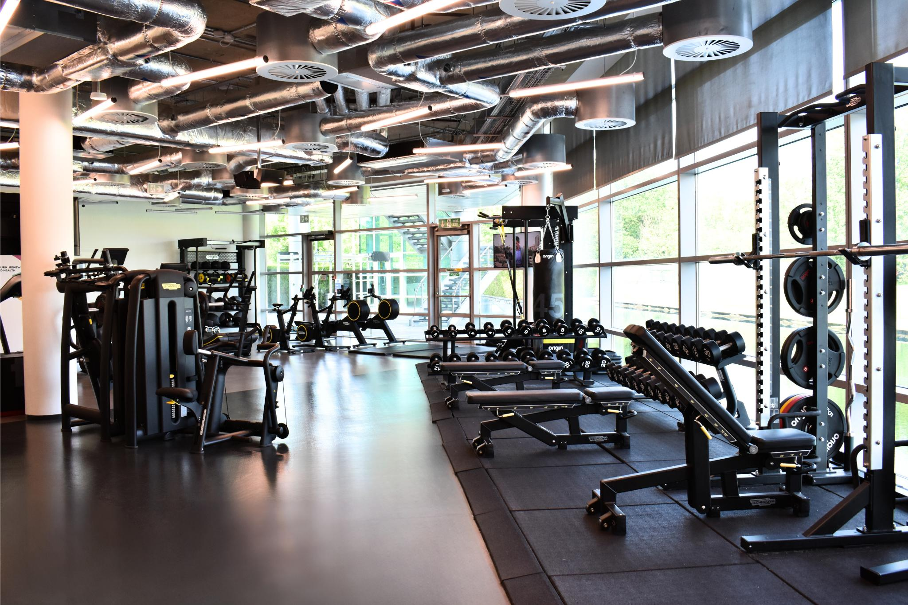

# 🏋️‍♀️ Gym Customer Churn & Retention Analysis

  

## 📌 Project Overview
This project aims to analyze **customer churn behavior** in a gym business and develop **data-driven retention strategies**.  
Using machine learning (Random Forest model), we identify the most influential factors affecting customer loyalty and provide actionable business recommendations.

---

## 🎯 Objectives
- To identify and understand the key factors that contribute to gym customer loyalty, enabling the company to enhance retention and prevent future churn.
- To develop an optimal predictive model for customer loyalty that can help identify high-risk customers and support data-driven retention strategies.

---

## 🧠 Machine Learning Model
### Model Used:
- **Ridge Classification**
- **KNN Classification**
- **Random Forest Classifier** (**BEST MODEL**)

### Best Model Highlights:
- Strong generalization performance (consistent on both train and test data).  
- Accurately identifies:
  - ✅ **True Positives (TP):** 185 customers correctly predicted to churn.  
  - ❌ **False Positives (FP):** 131 customers predicted to churn but didn’t.  
  - ✅ **True Negatives (TN):** 467 customers correctly predicted not to churn.  
  - ❌ **False Negatives (FN):** 17 customers who churned but were missed by the model.

### Top 5 Influential Features:
1. Customer Lifetime  
2. Age  
3. Contract Period  
4. Class Frequency  
5. Additional Spending  

---

## 💡 Key Insights
- Customers aged **25–35** have the **highest lifetime** and loyalty potential.  
- Most loyal customers live **near the gym** and often have a **partner**.  
- **Friend referral promos** work best for customers in nearby areas.  
- **Average visits:** 1–4 times per month  
- **Average additional spending:** \$50–\$200  
- As lifetime increases, class participation and spending tend to decline.

---

## 🛠️ Retention Strategy Recommendations
### 🔹 Lifetime & Contract-Based Retention Program
- Encourage longer contracts (6–12 months) with:
  - Loyalty renewal discounts  
  - Free class extensions  
  - Exclusive perks (premium class access)  
- Implement a **loyalty points system** that grows with membership duration.

### 🔹 Engagement & Accessibility
- Offer diverse group classes (Yoga, Zumba, Pilates).  
- Simplify class booking via mobile app.  
- Provide **online or cross-branch access** for customers living farther away.

### 🔹 Predictive Personalization
- Use model predictions to **flag high churn risk customers**.  
- Send **personalized reminders or offers** to re-engage them.

---

## 📂 Dataset Information
The dataset used for this project was sourced from **Kaggle**:

📎 **[Gym Customers Features and Churn — Kaggle Dataset](https://www.kaggle.com/datasets/adrianvinueza/gym-customers-features-and-churn)**  

The dataset contains detailed information about gym customers, including:
- Demographic features (age, gender, location)
- Behavioral data (visits, class participation, contract period)
- Spending behavior
- Churn label (whether a customer has left the gym)

This dataset serves as the foundation for analyzing customer retention behavior and building predictive models for churn.

---

## 📊 Tools & Libraries
- **Python**, **Pandas**, **Scikit-learn**, **Matplotlib**, **Seaborn**
- **Jupyter Notebook** for exploration & visualization

---

## 📈 Results Summary
The Random Forest model successfully identified key behavioral and demographic drivers of loyalty, providing the foundation for a targeted **retention and engagement strategy**.

---

## 👩‍💻 Author
**Zinedine Amalia**  
Data Analyst | Customer Insights & Retention Strategy  

## 🤝 Connect with Me

  
  
  

---

⭐ If you find this project useful, feel free to **star** or **fork** the repository!
